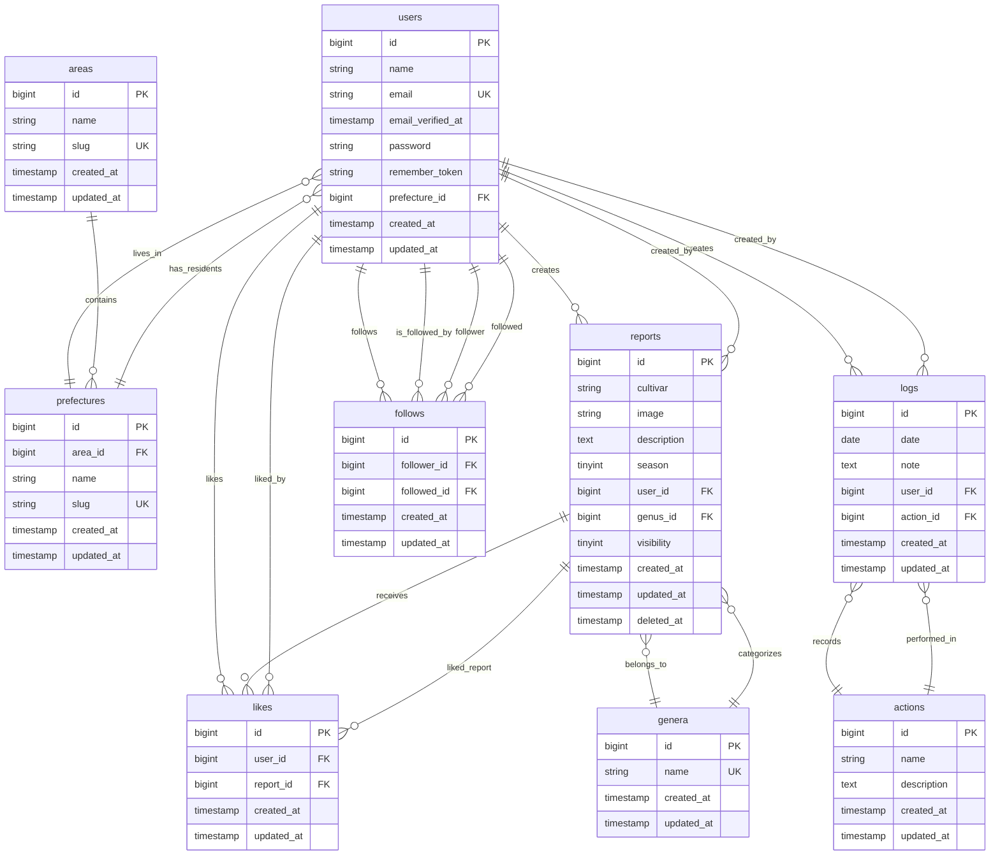

# Loguma with Succulents データベーススキーマ

## ER図

## テーブル詳細

### users（ユーザー）
- アプリケーションのユーザー情報
- 都道府県との関連付け

### areas（エリア）
- 地域区分（関東、関西など）
- 都道府県のグループ化

### prefectures（都道府県）
- 日本の都道府県情報
- エリアとの関連付け

### genera（属）
- 多肉植物の属分類
- レポートの分類に使用

### actions（アクション）
- お手入れの種類（水やり、植え替えなど）
- システム共通のアクション定義

### reports（レポート）
- 多肉植物の投稿・レポート
- 属、ユーザー、可視性設定
- ソフトデリート対応

### logs（ログ）
- お手入れの記録
- 日付、アクション、メモ
- ユーザーがアクションを実行した記録

### follows（フォロー）
- ユーザー間のフォロー関係
- 重複防止のユニーク制約

### likes（いいね）
- レポートへのいいね
- 重複防止のユニーク制約

## インデックス

- `users.email` - ユニーク
- `users.prefecture_id` - 外部キー
- `areas.slug` - ユニーク
- `prefectures.slug` - ユニーク
- `prefectures.area_id` - 外部キー
- `genera.name` - ユニーク
- `reports.user_id` - 外部キー
- `reports.genus_id` - 外部キー
- `logs.user_id` - 外部キー
- `logs.action_id` - 外部キー
- `follows.follower_id` - 外部キー
- `follows.followed_id` - 外部キー
- `follows.follower_id_followed_id` - ユニーク複合
- `likes.user_id` - 外部キー
- `likes.report_id` - 外部キー
- `likes.user_id_report_id` - ユニーク複合 